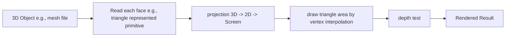

# Shadtakovich
Get hands dirty by building a simple shader. 

		
##### Rendering Pipeline	

##### Current Support Functions
|  functions   | tested |
|  ----  | ----  |
| Bresenham's line drawing algorithm (https://stackoverflow.com/questions/10060046/drawing-lines-with-bresenhams-line-algorithm)  | <ul><li>- [x] </li> |
| Bresenham's Line drawing modified (https://github.com/ssloy/tinyrenderer/wiki/Lesson-1:-Bresenham%E2%80%99s-Line-Drawing-Algorithm) | <ul><li>- [x] </li> |
| Midpoint line drawing algorithm (https://www.geeksforgeeks.org/mid-point-line-generation-algorithm/) | <ul><li>- [x] </li> |
|  Shadow mapping  |  <ul><li>- [x] </li> |
| Anti-aliasing| |

	
	
##### File Description
*  main.cpp
    > define transformation matrix (world->camera / camera->camera canonical / perspective + orthogonal transform / 3D canonical cube to 2D screen)  
    > define shader type (texture_fragment_shader / phong_fragment_shader)  
    > iosstream (read obj file / texture map; output rendered screen image)  
    > interaction (motion-based rendering from keyboard input)   
	
	
	

##### Reference List:
https://github.com/ssloy/tinyrenderer	\
Games 101 Course (https://www.bilibili.com/video/BV1X7411F744?p=11)		\
Games 202 Course (https://www.bilibili.com/video/BV1YK4y1T7yY?p=10)		\
Shadertoy 		 (https://www.shadertoy.com/results?query=&sort=hot&filter=vr)	
